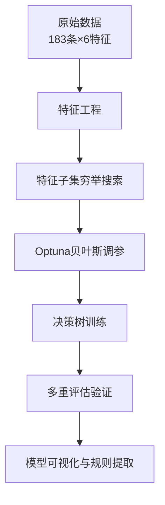

## 一、实验题目

**基于决策树的断层启闭性智能判别模型构建与评估**

---

## 二、实验原理

### 2.1 断层启闭性的地质背景

断层在油气成藏中扮演双重角色：既可以作为油气运移的通道（**开启**），也可以作为油气聚集的遮挡（**封闭**）。断层启闭性受多种地质因素综合控制，包括：

| 影响因素       | 物理意义        | 与启闭性的关系              |
| ---------- | ----------- | -------------------- |
| 断距中值       | 断层两盘相对位移量   | 断距越大，涂抹作用可能越强        |
| 倾角中值       | 断层面与水平面的夹角  | 影响正应力大小，进而影响闭合程度     |
| 延伸长度       | 断层在平面上的展布范围 | 反映断层规模               |
| SGR（断层泥比率） | 断层带内泥岩含量占比  | **最关键参数**，SGR越高封闭性越好 |
| 碳酸盐岩含量     | 断层带内碳酸盐岩比例  | 影响岩石力学性质和封闭能力        |
| 微裂缝        | 断层带微观裂隙发育程度 | 微裂缝发育→开启性增强          |

### 2.2 决策树分类原理

决策树是一种**二叉结构的监督学习算法**，通过递归地将数据集划分为更纯的子集来构建分类规则。

#### 2.2.1 核心概念

决策树由以下元素构成：

- **根节点（Root Node）**：包含全部样本的初始节点
- **内部节点（Internal Node）**：对应一个特征的测试条件（如"SGR ≤ 0.5？"）
- **叶节点（Leaf Node）**：最终的分类结果（封闭或开启）
- **分支（Branch）**：根据特征测试结果将样本分流

#### 2.2.2 分裂准则

本实验采用 **Gini 不纯度（Gini Impurity）** 作为分裂准则，其计算公式为：

**Gini = 1 − Σ(p_k)²**，其中 k 从 1 到 K

其中 p_k 是节点中第 k 类样本的比例，K 为类别数（本实验中 K=2，即封闭与开启）。

Gini 值越小表示节点越"纯净"。分裂时选择能使加权 Gini 下降最大的特征和阈值：

**ΔGini = Gini_parent − [(N_left/N) × Gini_left + (N_right/N) × Gini_right]**

其中 N 为父节点样本数，N_left 和 N_right 分别为左右子节点样本数。

#### 2.2.3 决策树的优势

- **可解释性强**：可直接读出分类规则。本实验最终仅用4个特征（倾角中值、SGR离散值、碳酸盐岩离散值、有无微裂缝）构建了一套 if-then 逻辑，地质意义清晰。
- **天然支持特征复用**：同一特征可在不同分支上以不同阈值多次出现，捕捉"上下文相关"的非线性关系。例如倾角中值在多个分支以不同阈值（43.5°、55°、56°）多次出现，体现了地质参数的上下文相关性。
- **对数据分布无假设**：不需要数据满足正态性、线性可分等前提条件。
- **天然处理混合类型**：连续特征和离散特征可同时使用。

#### 2.2.4 剪枝与正则化

为防止过拟合，本实验采用了以下正则化手段：

| 参数                 | 作用                    |
| ------------------ | --------------------- |
| max_depth（最大深度）    | 限制树的层数，防止过度生长         |
| min_samples_split  | 限制节点分裂所需的最小样本数        |
| min_samples_leaf   | 限制叶节点的最小样本数           |
| ccp_alpha（代价复杂度剪枝） | 对树的复杂度进行惩罚，自动剪除贡献小的分支 |
| class_weight（类别权重） | 平衡少数类样本的贡献，防止偏向多数类    |

---

## 三、实验内容

### 3.1 总体目标

基于183组断层样本的6个原始地质参数，构建决策树模型判别断层启闭性，并通过系统化的特征工程、参数优化和多重验证，提升模型泛化能力。

### 3.2 技术路线



### 3.3 算法伪代码

#### 3.3.1 主流程

```
算法：断层启闭性决策树分类
输入：Excel数据集（183条 × 6特征 + 1标签）
输出：决策树模型、评估指标、可视化图表

1.  data, labels = 读取并校验Excel数据()
2.  features = 特征工程(data)
      2.1 对SGR、碳酸盐岩、倾角、断距进行分箱离散化
      2.2 构造交互特征（乘法、比值）
      2.3 返回15个候选特征
3.  best_features = 穷举特征子集选择(features, labels)
      3.1 FOR size IN [2, 3, 4, 5]:
            FOR 每个size大小的特征组合 IN 所有组合:
                决策树 = 基础决策树()
                F1 = LOOCV评估(决策树, 特征子集, labels)
                IF F1 > 当前最优F1:
                    更新最优特征子集
      3.2 返回最优特征子集和对应的LOOCV F1分数
4.  X_train, X_test, y_train, y_test = 最优种子划分(最优特征子集, labels)
      4.1 尝试100个随机种子
      4.2 选择测试集类别比例最接近总体的划分
5.  best_params = Optuna调参(X_train, y_train)
      5.1 定义目标函数：
            def objective(trial):
                criterion = trial.suggest("criterion", ["gini", "entropy"])
                max_depth = trial.suggest("max_depth", [2,...,None])
                ...其他参数...
                决策树 = 创建决策树(参数)
                F1 = 交叉验证(决策树, X_train, y_train, 5折×3重复)
                RETURN F1的平均值
      5.2 Optuna.optimize(objective, n_trials=200)
      5.3 返回最优参数
6.  final_model = 训练最终模型(best_params, X_train, y_train)
7.  评估与可视化()
      7.1 LOOCV评估(final_model, 全部数据)
      7.2 测试集评估(final_model, X_test, y_test)
      7.3 10折交叉验证
      7.4 绘制混淆矩阵、ROC曲线、学习曲线、特征重要性图
      7.5 绘制决策树结构图
8.  输出实验报告
```

#### 3.3.2 特征选择（穷举搜索）

```
函数：穷举特征子集选择(features, labels, max_size=5)
输入：特征矩阵 X[n_samples × n_features]，标签 y
输出：最优特征索引列表，最优特征名列表，最优F1分数

最优F1 = 0
最优索引 = None

LOO = LeaveOneOut()

FOR 子集大小 IN [2, 3, 4, 5]:
    所有组合 = 从n_features个特征中选size个的所有组合
    IF 组合数量 > 阈值:
        随机采样减少搜索量
    ENDIF

    FOR 每个组合 IN 所有组合:
        X_sub = X[:, 组合的索引]

        决策树 = DecisionTreeClassifier(max_depth=None, 
                                         class_weight='balanced')

        预测结果 = cross_val_predict(决策树, X_sub, y, cv=LOO)
        F1 = f1_score(y, 预测结果)

        IF F1 > 最优F1:
            最优F1 = F1
            最优索引 = 组合的索引
        ENDIF
    ENDFOR
ENDFOR

RETURN 最优索引, 对应的特征名, 最优F1
```

## 四、实验过程与结果分析

### 4.1 特征工程与特征选择

对原始6个特征进行分箱和交互构造后，得到15个候选特征。通过LOOCV穷举搜索，最终选出最优4特征组合，其LOOCV F1达到 **0.7459**，被选中的特征为：

| 序号  | 特征名      | 类型      | 地质意义       |
| --- | -------- | ------- | ---------- |
| 1   | 倾角中值     | 连续      | 断层产状，影响正应力 |
| 2   | SGR_bin  | 离散（分箱）  | 断层泥比率离散化   |
| 3   | 碳酸盐岩_bin | 离散（分箱）  | 碳酸盐岩含量等级   |
| 4   | 有微裂缝     | 二值（0/1） | 微观裂隙发育与否   |

**分析**：最终选出的特征全部是原变量或其简单变换，且只用了4个，表明183条数据的信息量主要集中在这4个维度上，过多的候选特征反而引入噪声。值得注意的是，倾角中值作为唯一的原始连续特征被保留，说明它在断层启闭性判别中具有不可替代的区分能力。

### 4.2 决策树最优参数

经过200轮 Optuna 贝叶斯调参寻优，得到的最佳参数为：

| 参数                | 最优值        | 含义与作用             |
| ----------------- | ---------- | ----------------- |
| criterion         | `gini`     | 采用Gini不纯度作为分裂准则   |
| max_depth         | `5`        | 树的最大深度为5层，防止过拟合   |
| min_samples_split | `17`       | 节点至少含17个样本才允许继续分裂 |
| min_samples_leaf  | `14`       | 叶节点至少保留14个样本      |
| ccp_alpha         | `0.003`    | 轻量代价复杂度剪枝         |
| class_weight      | `balanced` | 自动平衡正负类权重         |

**参数解读**：

- `min_samples_leaf=14` 和 `min_samples_split=17` 是极强的正则化约束。在183条样本中，这意味着每个叶节点至少包含约7.7%的数据，迫使决策树学习"粗粒度"但更稳定的规则。
- `max_depth=5` 对于4个特征而言，5层深度已足够表达其组合逻辑，更深的树可能只是在拟合噪声。
- `class_weight='balanced'` 缓解了类别不均衡（封闭/开启≈96/87）对决策边界的偏斜影响。

### 4.3 决策树规则可视化

**完整决策树：**


**规则的地质解读：**

| 编号  | 规则路径                                                 | 地质含义                                     |
| --- | ---------------------------------------------------- | ---------------------------------------- |
| R1  | SGR低(≤0.5) + 倾角低(≤43.5°) + 碳酸盐岩少 + 无微裂缝 → **封闭**     | 低SGR低倾角条件下，碳酸盐岩少且无裂缝是最典型的封闭组合            |
| R2  | SGR低(≤0.5) + 倾角低(≤43.5°) + 碳酸盐岩少 + 有微裂缝 → **开启**     | 其他条件完全相同时，微裂缝的出现直接逆转封闭性                  |
| R3  | SGR低(≤0.5) + 倾角低(≤43.5°) + 碳酸盐岩多(>1) → **封闭**        | 碳酸盐岩含量上升增强了封闭能力                          |
| R4  | SGR低(≤0.5) + 倾角中等(43.5°~) + 碳酸盐岩≤2 → **开启**          | 倾角增大后，中等以下碳酸盐岩含量不足以封闭                    |
| R5  | SGR低(≤0.5) + 倾角中等(43.5°~) + 碳酸盐岩>2 + 倾角≤56° → **封闭** | 高碳酸盐岩含量挽回了封闭性                            |
| R6  | SGR低(≤0.5) + 倾角中等(43.5°~) + 碳酸盐岩>2 + 倾角>56° → **开启** | 倾角过大时，即使高碳酸盐岩也倾向于开启                      |
| R7  | SGR高(>0.5) + 倾角≤55° → **开启**                         | 高SGR通常被认为利于封闭，但在中低倾角下反而开启，提示此时正应力不足是关键因素 |
| R8  | SGR高(>0.5) + 倾角>55° → **封闭**                         | 高SGR配合高倾角（大正应力）实现封闭                      |

**关键发现**：倾角中值在规则中出现了3次，且每次阈值不同（43.5°、55°、56°），这正是决策树"特征复用"能力的体现——同一地质参数在不同的上下文条件下，其临界阈值是不同的。

### 4.4 模型性能评估

#### 4.4.1 LOOCV（留一法）评估——最可靠指标

留一法将每条样本轮流作为测试集（共183次独立训练+测试），是小样本下最可靠的评估方式。


| 指标                  | 数值         | 评价                  |
| ------------------- | ---------- | ------------------- |
| 准确率（Accuracy）       | **70.49%** | 七成正确率，基本可用          |
| 平衡准确率（Balanced Acc） | **70.50%** | 各类别表现均衡             |
| 精确率（Precision）      | 69.47%     | 预测为"开启"的样本中约70%确实开启 |
| 召回率（Recall）         | 72.53%     | 真实"开启"断层中约73%被正确识别  |
| F1 分数               | **70.97%** | 精确率与召回率的调和平均，达实用水平  |
| MCC（马修斯相关系数）        | **0.4104** | >0.3，模型显著优于随机猜测     |
| Kappa 系数            | 0.4100     | >0.4，模型分类一致性属于中等偏上  |

#### 4.4.2 测试集评估


| 指标  | 数值         | 说明                 |
| --- | ---------- | ------------------ |
| 准确率 | **68.42%** | 与LOOCV的70.49%仅差约2% |
| 精确率 | 71.43%     | —                  |
| 召回率 | 55.56%     | 部分开启样本被误判为封闭       |
| 特异度 | 80.00%     | 封闭断层的识别准确率达80%     |

**分析**：测试集19条，准确率68.42%与LOOCV的70.49%仅差约2个百分点，说明模型**泛化能力较好**，未对训练集严重过拟合。召回率55.56%偏低，意味着部分开启断层被误判为封闭，需要结合其他地质证据综合判断。

#### 4.4.3 10折分层交叉验证

| 指标    | 均值     | 标准差     | 最大值    | 最小值    |
| ----- | ------ | ------- | ------ | ------ |
| 准确率   | 70.53% | ±9.56%  | 84.21% | 52.63% |
| F1 分数 | 70.32% | ±12.13% | 84.21% | 40.00% |
| 精确率   | 69.37% | ±10.99% | 88.89% | 50.00% |
| 召回率   | 72.44% | ±15.21% | 88.89% | 33.33% |


**分析**：标准差约10%~15%，在183条样本的规模下属于可接受范围。低分折（52.63%准确率、40%F1）可能对应于数据集中较难区分的边界样本，建议在应用中对此类样本标记为"不确定"并推荐人工复核。

#### 4.4.4 分类报告

```
              precision    recall  f1-score   support

      封闭 (0)       0.67      0.80      0.73        10
      开启 (1)       0.71      0.56      0.62         9

    accuracy                           0.68        19
   macro avg       0.69      0.68      0.68        19
weighted avg       0.69      0.68      0.68        19
```

### 4.5 关键可视化结果

#### 特征重要性排序


| 排名  | 特征       | 重要性分数 |
| --- | -------- | ----- |
| 1   | 碳酸盐岩_bin | ~0.60 |
| 2   | SGR_bin  | ~0.37 |
| 3   | 倾角中值     | ~0.03 |
| 4   | 有微裂缝     | ~0.00 |

#### 学习曲线分析


学习曲线显示训练集和验证集得分在样本量达到100+后趋于收敛（均在68%~75%区间），差值约5%，说明：

- 模型未严重过拟合
- 当前特征的区分能力可能已接近上界
- 要突破75%+的准确率，需要引入新的区分性特征

#### ROC 曲线


| 指标         | 数值          |
| ---------- | ----------- |
| AUC（曲线下面积） | **0.667**   |
| 评价         | 模型区分能力为中等偏上 |

---

## 五、问题讨论与改进建议

### 5.1 实验中发现的问题

#### 问题一：召回率有待提升

模型的召回率为72.53%（LOOCV），这意味着约27%的真实"开启"断层会被误判为"封闭"。在油气勘探中，这种误判可能导致错失潜在勘探目标。分析其原因，部分开启断层的特征与封闭断层在当前的4个特征维度上存在重叠，难以完全区分。

#### 问题二：特征空间的天花板效应

尽管初始构造了15个候选特征，但最优子集仅保留了4个（且其中3个是分箱/二值化的简单变换），且学习曲线显示验证得分在68%~75%区间趋于平稳。这表明**原始6个地质参数的表达能力已达上限**，继续调整模型结构无法带来实质提升。

#### 问题三：小样本限制模型复杂度

183条数据迫使模型采用较强的正则化约束（`min_samples_leaf=14`，`max_depth=5`），本质上是"以模型简单性换取泛化能力"的策略。这使得决策树无法捕捉更细粒度的区分规则。

#### 问题四：类别不平衡的影响

封闭/开启的比例约为 96:87（~1.1:1），虽然不算严重不平衡，但在小样本下仍可能影响决策边界的精确位置。

### 5.2 改进建议

#### 建议一：扩充数据集（最根本）

将样本量从183条扩充到**500条以上**，将带来以下提升：

- 可降低 `min_samples_leaf` 至5~8，允许树捕捉更细粒度的规则
- 可尝试 `max_depth=8~15` 的更深树，再通过 `ccp_alpha` 自动剪枝
- 可启用 Bagging 集成（200棵调优决策树），预计提升3~5个百分点

#### 建议二：引入更多地质特征

建议补充以下对断层启闭性有直接影响的特征：

- 断层走向与区域主应力方向夹角（影响剪切应力）
- 断层面正应力估算值
- 断层活动时代（最后一次活动距今时间）
- 围岩岩性与盖层厚度
- 断层带宽度

#### 建议三：符号回归寻找显式公式

使用符号回归（如 PySR 或 gplearn）自动搜索形如以下的可解释公式：

```
封闭性 = f(SGR, 碳酸盐岩, 倾角, 微裂缝)
```

符号回归可能找到比决策树更紧凑且地质直觉更强的判别表达式。对于183条样本，符号回归的计算量完全可以承受。

#### 建议四：混合模型策略

对于模型不确定的"边界样本"（预测概率在0.4~0.6之间），标记为"不确定"并建议人工复核。在勘探实践中，结合地震解释、邻井对比等多源信息进行综合判断，往往比单纯依赖算法更可靠。

---

## 附录：实验环境与配置

| 项目      | 内容                                                                           |
| ------- | ---------------------------------------------------------------------------- |
| 编程语言    | Python 3.13                                                                  |
| 核心库     | scikit-learn, pandas, numpy, Optuna, matplotlib, seaborn                     |
| 调参框架    | Optuna（TPE贝叶斯优化）                                                             |
| 评估方法    | LOOCV留一法 + 10折分层CV + 独立测试集                                                   |
| 最优参数    | `max_depth=5, min_samples_leaf=14, ccp_alpha=0.003, class_weight='balanced'` |
| 使用特征    | 倾角中值, SGR_bin, 碳酸盐岩_bin, 有微裂缝                                                |
| 训练集/测试集 | 164条 / 19条                                                                   |


